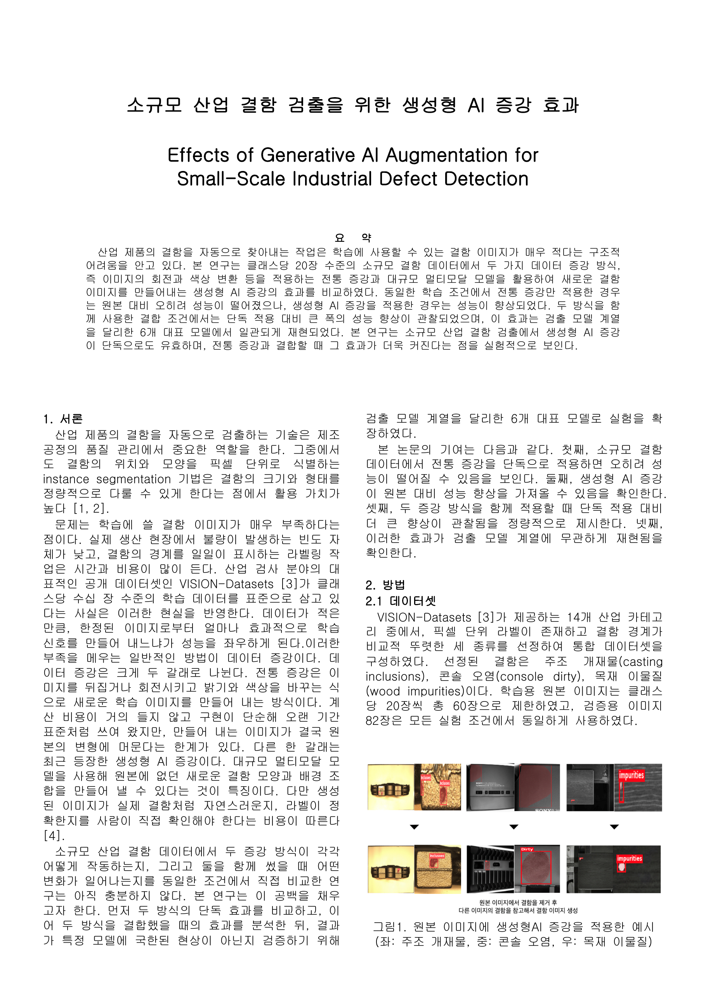
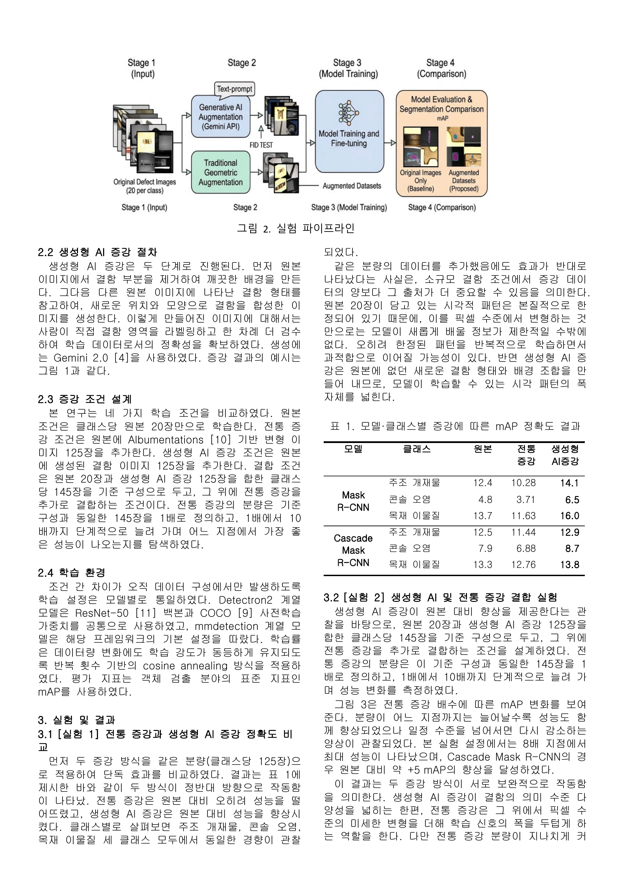
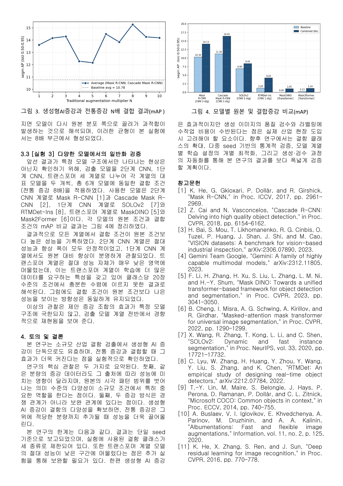

# Effects of Generative AI Augmentation for Small-Scale Industrial Defect Detection

> 소규모 산업 결함 검출을 위한 생성형 AI 증강 효과 — Official code & resources.

<h3 align="center">📄 논문 전문 보기 (PDF)</h3>
<p align="center">
  <a href="paper/paper_ko.pdf"><b>▶ 국문 PDF 열기 (GitHub PDF 뷰어)</b></a> &nbsp;|&nbsp;
  <a href="paper/paper_en_arxiv.pdf"><b>▶ English arXiv preprint</b></a>
</p>

<p align="center">
  <a href="paper/paper_ko.pdf"></a>
</p>
<p align="center">
  <a href="paper/paper_ko.pdf"></a>
</p>
<p align="center">
  <a href="paper/paper_ko.pdf"></a>
</p>

> 위 이미지를 클릭하면 GitHub 내장 PDF 뷰어로 논문 원본이 즉시 열립니다.

---

## TL;DR
- 소규모 산업 결함 데이터(클래스당 ≈ 20장)는 학습 신호가 만성적으로 부족합니다.
- 본 연구는 **전통 기하/색상 증강(Albumentations)** 과 **생성형 AI 증강(Gemini 2.0)** 의 효과를 동일 조건에서 비교합니다.
- **전통 증강 단독**은 원본 대비 오히려 mAP를 떨어뜨립니다. **생성형 AI 증강 단독**은 원본 대비 mAP를 향상시킵니다.
- 두 방식을 **함께 사용**할 때 효과가 가장 크며, Cascade Mask R-CNN 기준 약 **+5 mAP** 향상이 관찰됩니다 (전통 증강 8배 지점).
- 이 경향은 **6개 대표 인스턴스 분할 모델**(2-stage CNN, 1-stage CNN, Transformer)에서 일관되게 재현됩니다.

## 핵심 기여
1. 클래스당 20장 수준의 소규모 결함 조건에서 **전통 증강 단독은 성능을 오히려 저하**시킨다는 점을 정량적으로 보임.
2. **생성형 AI 증강 단독은 원본 대비 mAP를 향상**시킴을 확인.
3. 두 증강 방식이 **경쟁이 아닌 보완 관계**에 있으며, 결합 시 단독 적용 대비 더 큰 향상이 가능함을 입증.
4. 결과가 특정 모델 구조에 국한되지 않고 **6개 모델 계열 전반에 걸쳐 일관**됨을 검증.

---

## 실험 파이프라인

| Stage | 내용 |
|-------|------|
| 1. Input | 클래스당 원본 결함 이미지 20장 |
| 2. Augmentation | (a) Gemini 2.0 텍스트 프롬프트 기반 **생성형 증강** + 라벨 재검수 / (b) Albumentations 기반 **전통 증강** |
| 3. Model Training | Detectron2 / mmdetection · ResNet-50 (COCO pretrain) · cosine annealing, 반복 횟수 고정 |
| 4. Comparison | 82장 테스트셋에서 **mAP @ IoU 0.50:0.95** 비교 |

각 조건 간 차이는 오직 **학습 데이터 구성**에서만 발생하도록 학습 설정을 통제했습니다.

---

## 데이터셋
- **출처**: [VISION-Datasets](https://arxiv.org/abs/2306.07890) — 14개 산업 카테고리, 픽셀 단위 라벨.
- **선정 클래스 3종** (결함 경계가 명확한 클래스):
  - Casting Inclusions (주조 개재물)
  - Console Dirty (콘솔 오염)
  - Wood Impurities (목재 이물질)
- **분할**:
  - Train: 클래스당 20장 (총 60장)
  - Test: 82장 (모든 조건에서 동일)

## 학습 조건

| 조건 | 원본 | 전통 증강 | 생성형 AI 증강 | 클래스당 총량 |
|------|-----:|---------:|---------------:|--------------:|
| `original_only` (Baseline) | 20 | — | — | 20 |
| `cond1` Traditional only | 20 | +125 | — | 145 |
| `cond2` Generative AI only | 20 | — | +125 | 145 |
| `cond3` / `cond4_*x` Combined | 20 | +125 × N (N = 1…10) | +125 | 145 + 125·(N−1) |

N은 1~10배 구간에서 탐색하며 최적값은 **N = 8** 부근입니다.

## 평가 모델 (6종)

| 계열 | 모델 |
|------|------|
| 2-stage CNN | Mask R-CNN · Cascade Mask R-CNN |
| 1-stage CNN | SOLOv2 · RTMDet-Ins |
| Transformer | Mask DINO · Mask2Former |

---

## 주요 결과

### 실험 1 — 단독 증강 비교 (Table 1)

| 모델 | 클래스 | 원본 | 전통 증강 | 생성형 AI |
|------|--------|-----:|---------:|----------:|
| Mask R-CNN | 주조 개재물 | 12.4 | 10.28 | **14.1** |
| Mask R-CNN | 콘솔 오염 | 4.8 | 3.71 | **6.5** |
| Mask R-CNN | 목재 이물질 | 13.7 | 11.63 | **16.0** |
| Cascade Mask R-CNN | 주조 개재물 | 12.5 | 11.44 | **12.9** |
| Cascade Mask R-CNN | 콘솔 오염 | 7.9 | 6.88 | **8.7** |
| Cascade Mask R-CNN | 목재 이물질 | 13.3 | 12.76 | **13.8** |

→ 모든 (모델, 클래스) 셀에서 **생성형 AI > 원본 > 전통 증강** 순서가 유지됨.

### 실험 2 — 결합 증강 N배 sweep (Figure 3)
- Mask R-CNN / Cascade Mask R-CNN 평균 mAP 기준.
- 원본 단독 평균 ≈ **10.78** (baseline).
- 결합 증강은 N이 커질수록 성능이 향상되다가 **N = 8** 부근에서 최고치, 이후 다시 감소.
- Cascade Mask R-CNN 기준 원본 대비 **약 +5 mAP** 향상.

### 실험 3 — 6개 모델 전반의 일반화 (Figure 4)
Baseline(원본 20장) vs Combined (원본 20장 + AI 125장 + 전통 8배):

| 모델 | Baseline | Combined (8×) |
|------|---------:|--------------:|
| Mask R-CNN | 11.30 | **14.13** |
| Cascade Mask R-CNN | 11.26 | **16.41** |
| SOLOv2 | 6.80 | **8.40** |
| RTMDet-Ins | 1.20 | **4.21** |
| Mask DINO | 0.01 | 1.15 |
| Mask2Former | 0.13 | 1.14 |

상승 방향성은 6개 모델 모두에서 동일하게 관찰됩니다. 트랜스포머 계열은 학습에 더 많은 데이터를 요구하는 특성상 절대 성능 자체가 낮은 구간에 머무릅니다.

---

## 저장소 구성

```
VISION-Instance-Seg/
├── training/                       # 통합 학습 CLI
│   ├── train.py                    # python -m training.train ...
│   ├── train_template.py
│   ├── evaluate.py
│   ├── data_pipeline.py
│   ├── config.py
│   ├── adapters/                   # Detectron2 / mmdet 어댑터
│   ├── maskdino/                   # Mask DINO 통합
│   └── utils/
├── scripts/
│   ├── augmentation/
│   │   ├── gemini_augment.py       # Gemini 2.0 생성형 증강
│   │   ├── traditional_augment.py  # Albumentations 전통 증강
│   │   ├── prepare_reference_images.py
│   │   └── prompts/                # 프롬프트 템플릿
│   ├── data_utils/                 # 서브셋·매니페스트 유틸
│   ├── evaluation/
│   │   ├── analyze_results.py
│   │   └── analyze_maskdino_results.py
│   └── FID_test/                   # 생성 품질 FID 검증
├── labeling_server/                # 생성 이미지 라벨 재검수용 웹툴
├── notebooks/                      # 분석·시각화 노트북
└── docs/
```

## 설치

```bash
conda create -n vision-instance python=3.10 -y
conda activate vision-instance

# PyTorch (CUDA 12.1 예시)
pip install torch==2.3.1 torchvision==0.18.1 --index-url https://download.pytorch.org/whl/cu121

# Detectron2 (Mask R-CNN, Cascade Mask R-CNN)
python -m pip install 'git+https://github.com/facebookresearch/detectron2.git'

# mmdetection (SOLOv2, RTMDet-Ins, Mask DINO, Mask2Former)
pip install -U openmim
mim install mmengine "mmcv>=2.0.0" mmdet
```

생성형 증강을 사용하려면 Gemini API 키가 필요합니다.

```bash
export GEMINI_API_KEY="..."
```

## 재현 절차

```bash
# 1) 생성형 / 전통 증강 데이터 생성
python scripts/augmentation/gemini_augment.py         # 생성형 증강 (per_class=125)
python scripts/augmentation/traditional_augment.py    # 전통 증강 (N배 옵션)

# 2) 단일 모델 × 단일 조건 학습
python -m training.train \
    --category Cable \
    --experiment exp2 \
    --condition cond1 \
    --model mask_rcnn

# 3) 전체 조건 (original_only / cond1 / cond2 / cond3 / cond4_8x) 일괄 학습
python -m training.train --category Cable --experiment exp2 --condition all --model maskdino

# 4) 6개 모델 비교 (논문 Figure 4)
python -m training.train --category Cable --experiment exp3 --condition original_only --model all

# 5) 결과 집계 & 시각화
python scripts/evaluation/analyze_results.py
python scripts/evaluation/analyze_maskdino_results.py
```

학습 CLI는 에폭 기반 + Early Stopping을 지원합니다. `--max-epochs`, `--lr`, `--patience` 등으로 오버라이드할 수 있습니다.

---

## 한계 및 향후 연구
- 결과가 **단일 seed** 기준으로 보고됨 → 다중 seed 통계 검증 필요.
- 결함 클래스가 **3종**으로 제한 → 클래스 확대 필요.
- 트랜스포머 계열은 절대 성능이 낮은 구간에 머묾 → 추가 실험 필요.
- 생성 이미지의 품질 검수·재라벨링에 **수작업 비용**이 수반되므로 검수 자동화가 필요.

향후 연구에서는 결함 클래스 확대, 다중 seed 기반 통계 검증, 모델 계열별 학습 설정의 개별 최적화, 생성·검수 자동화를 다룰 계획입니다.

---

## Citation

```bibtex
@article{vision_genaug_2025,
  title   = {Effects of Generative AI Augmentation for Small-Scale Industrial Defect Detection},
  author  = {Joo, Jinho and collaborators},
  journal = {arXiv preprint},
  year    = {2025}
}
```

## References
1. K. He *et al.* "Mask R-CNN." *ICCV* 2017.
2. Z. Cai and N. Vasconcelos. "Cascade R-CNN: Delving into High Quality Object Detection." *CVPR* 2018.
3. H. Bai *et al.* "VISION Datasets: A Benchmark for Vision-Based Industrial Inspection." *arXiv:2306.07890*, 2023.
4. Gemini Team Google. "Gemini: A Family of Highly Capable Multimodal Models." *arXiv:2312.11805*, 2023.
5. F. Li *et al.* "Mask DINO: Towards a Unified Transformer-Based Framework for Object Detection and Segmentation." *CVPR* 2023.
6. B. Cheng *et al.* "Masked-attention Mask Transformer for Universal Image Segmentation." *CVPR* 2022.
7. X. Wang *et al.* "SOLOv2: Dynamic and Fast Instance Segmentation." *NeurIPS* 2020.
8. C. Lyu *et al.* "RTMDet: An Empirical Study of Designing Real-Time Object Detectors." *arXiv:2212.07784*, 2022.
9. T.-Y. Lin *et al.* "Microsoft COCO: Common Objects in Context." *ECCV* 2014.
10. A. Buslaev *et al.* "Albumentations: Fast and Flexible Image Augmentations." *Information*, 2020.
11. K. He *et al.* "Deep Residual Learning for Image Recognition." *CVPR* 2016.

## License
See [LICENSE](LICENSE).
